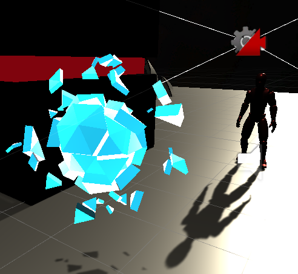

**The University of Melbourne**
# COMP30019 – Graphics and Interaction

Final Electronic Submission (project): **4pm, Fri. 6 November**

Do not forget **One member** of your group must submit a text file to the LMS (Canvas) by the due date which includes the commit ID of your final submission.

You can add a link to your Gameplay Video here but you must have already submit it by **4pm, Sun. 25 October**

# Project-2 OVER THE EARTH

OVER THE EARTH is a third-player-shooter (TPS) game taking place on a serise of near-Earth space platforms. Player will have to fight through a number of stages of different objectives, pick up buff capusules to upgrade themselves, and eventually defeat a boss to finish the game.

The gameplay video is uploaded on youtube: https://www.youtube.com/watch?v=ZRXzCtbxhHI&t=12s

In the following sections, we'll briefly work through the gameplay and implementations of visual effects.

<p align="center">
  
</p>


## Table of contents
* [Team Members](#team-members)
* [The Game](#the-game)
* [Explanation of the game](#explanation-of-the-game)
* [Models](#models)
* [Visual Effects](#effects)
* [Feedback and Evaluation](#feedbacks)
* [Custom Shaders](#shader)
* [Credits](#credits)

## Team Members

| Name | Task | State |
| :---         |     :---:      |          ---: |
|  Huijun   | Hitbox | Deployed   |
|   Matt & Haoqi   |  Interactive  |  Deployed  |
|   Team   | UI | Deployed |
| Zeyu | Report & README | Deployed |
| Team    |  Modelling  |  Deployed  |
|  Team   | Shader & effect | Deployed |
|        Zeyu        |        Level design            | Deployed  |

## The Game
Excluding the tutorial stage, there're three stages to our game:
* Survival: player has to survive on the platform as enemies spawn periodcally for a period of time
<p align="center">
  
</p>
* King of The Hill/Point Capture: player has to stay on a platform to charge it to finish the stage, and leaving the platform will decrease the charge
<p align="center">
  
</p>
* Boss: player has to defeat the final boss equipped with a number of abilities
<p align="center">
  
</p>

Upon completing a stage, a portal will appear to allow the player to enter the next stage.
<p align="center">
  
</p>

	
## Models
Most models are built from https://assetstore.unity.com/packages/3d/environments/sci-fi/low-poly-space-rocks-58385, a collection of low-poly space rocks.


## Effects

Range-attack enemy can fire a iceball projectile. The model of projectile comes from the model set as mentioned above, and the shader to achieve the "ice" effect is discussed in detail in later section.
<p align="center">
  
</p>

<p align="center">
  
</p>


A shockwave-like on-hit effect is produced when player lands the beam on enemies or obstacles.
<p align="center">
  
</p>

To create a gif from a video you can follow this [link](https://ezgif.com/video-to-gif/ezgif-6-55f4b3b086d4.mov).

Shooting effect is achieved by Raycast.
* First we draw an invisible ray from the camera and detect whether the ray passes through any object with a collider.
* If the ray has hit an object with collider, we use line renderer to render a laser line from the fire point to the intersection point of the ray and the collider.

## Feedbacks

We gathered feedback from a total of 12 people, using a questionaire (7 participants) and think-aloud interview (5 participants) techniques.

The questionaire sets 17 questions over the four stages of the game, that the participants may fill in after they finished the game. Each question allows the participant to make a response from 1-5 based on how much they agree with the question topic.

The questions include:
* "this level is fun to play";
* "this level is easy to master";
* "the elements of the level interact well with one another";
along with some overall questions regarding the game. There are more open-ended questions where the participants can optionally answer to express their opinions on enemy design, difficulty, player control and other aspects of the game. Participants are also free to point out what they believe to be a bad design or bug, which help us further understand and improve the game.

In general, most participants agreed that the game is visually pleasing and the gameplay is easy to understand. Comments are distributed across the stages, such as the boss stage is considered much easier than the previous ones.
<p align="center">
  
</p>

<p align="center">
  
</p>

<p align="center">
  
</p>

Please see https://docs.google.com/forms/d/1Lt9CKWEWj4fKHmhLGxFtO8K1vRZP7tQRNPYDpRXD8gU/edit#responses for all the responses. 

The think-aloud section is conducted by having a live chat with the participants while they're playing the game, who were told to give their instant comment/thought on the game as they play.

* Among the comments we recieved, most participants point out a lack of difficulty in the final stage, while the comments to the previous stages are distributed. 
	* Participants without prior TPS experience finds it harder to dodge while shooting at the same time.
	* Participants with such experience, however, quickly finds the game easy when their buff is high enough to one-shoot enemies
* Most participants feel comfortable with the control and stage design, while some who had no prior experience to TPS  (or video game in general) faced difficulty understanding the features. 
	* For example, in KOH stage, some participants would not be able to figure out "where to capture" as there is no clear indicator to the middle platform, which a more experienced player would otherwise notice. We therefore added a clearer indicator to the capture area.
* Most participants reported that the tutorial stage is necessary to introduce the control and gameplay, but the guidance was unclear.
	* In the Tutorial Stage, some participants missed the tutorial scripts, which was originally placed as "cardboards hanging on walls", and couldn't figure out the controls. We therefore replaced the component with a on-screen tutorial text that will stay on screen for players to read.

A list of changes we made after the survey is shown below. There are also some minor quality-of-life changes to make the game generally more playable.

### Changelog
 
* Tutorial is confusing for some participants
	* clearer on-screen guidance on control and added some basic information to tutorial guide (e.g. WASD to move)
	* on-screen text guidance that stays on screen instead of the "cardboard-on-wall" style that could be missed
* Serveral participants point out that there is no clear indicator of "where to capture" in the KOH stage
	* a green circle indicator was added to the stage to more clearly indicate the objective
* The boss is too easy and others are sometimes too hard
	* adjustments were made to the game stats (*there was also a bug with boss attack move and it's fixed)
* Can't move mouse after killing the boss (*it's a bug)
	* it has been fixed
* Game color feels too dark
	* adjusted the light source to make the areas more visible. The game is overall dark in color as that is the theme of the assets.
* Mixed comments on stage difficulties and most participants agreed KOH stage is harder than the rest
	* adjusted spawning to reasonable level. Will implement Difficulty setting if possible
* Sometimes there's no buff at all
	* originally enemies will just be "removed" once a stage is cleared, and player can't loot anything from un-killed enemies. Now all enemies are destroyed on stage clear and drops their buffs for the player to collect and prepare for the next stage
* Laser feels odd when at max fire rate
	* adjusted the max fire rate from 0.1s to 0.2s. This was possibly due to the laser not being properly rendered when fired at fast pace.
* Some participants reported the crosshair didn't precisely align to the actual shooting
	* it was an issue related to how the Cinemachine works and has been fixed
* There is no music
	* added some sound effect to actions including stage cleared, being hit and so on.
	* there won't be background music if we're unable to find a suitable free soundtrack anyway


## Shader 
### 1. Ice fragment Shdaer
 - The purpose is: We have a kind of ice remote enemy, so we think if it could shoot some ice fragment it will be very real.
 - Implement: There are three sections in this shader 
  1. Transparent effect <br>
 For each hypothesis, to determine its non-overlapping, we need to calculate the dot product of the surface normal and the viewing direction. 
 ```
 Tags
 {
  "Queue" = "Transparent"
 }
     
        // compute sillouette factor
        float edgeFactor = abs(dot(input.viewDir, input.normal));
        float oneMinusEdge = 1.0 - edgeFactor;
        // get sillouette color
        float3 rgb = tex2D(_RampTex, float2(oneMinusEdge, 1.2)).rgb;
        // get sillouette opacity
        float opacity = max(1.0, _Color.a / edgeFactor);
        opacity = pow(opacity, _EdgeThickness);
 ```
 2. Shadow level <br>
 Add normals in the input data，ennsure that even when the object rotates, the lighting effect can be changed
 ```
 Tags 
 {
  "LightMode" = "ShadowCaster"
 }
     
        // apply ramp & bump map
        float3 bump = tex2D(_BumpTex, input.texCoord.xy).rgb + input.normal.xyz;
        float3 lightDir = normalize(_WorldSpaceLightPos0.xyz);
        float ramp = clamp(dot(bump, lightDir), 0.001, 1.0);
        float4 lighting = float4(tex2D(_BumpRamp, float2(ramp, 0.5)).rgb, 1.0);
 ```
 
 3. Distortion effect <br>
 Grab the background texture after the ice cube, then distort its vertex position, and finally draw it out.
 ```
 GrabPass
        {
            "_BackgroundTexture"
        }
 
 // distort based on bump map
 float3 bump = tex2Dlod(_BumpTex, float4(input.texCoord.xy, 0, 0)).rgb;
 output.grabPos.x += bump.x * _DistortStrength;
 output.grabPos.y += bump.y * _DistortStrength;
 ```

### 2. Hit effect
  -The purpose is: we create an hit effect using particle system, this shader is used for the hit effect to create a bright and realistic hit effect.
  <p align="center">
  
  </p>
  
## Credits

* Most in-game models from: https://assetstore.unity.com/packages/3d/environments/sci-fi/low-poly-space-rocks-58385
* Player model and animation: https://assetstore.unity.com/packages/vfx/shaders/ultimate-10-shaders-168611
* Trident model in Tutorial: https://assetstore.unity.com/packages/3d/vehicles/space/uav-trident-46128
* Skybox: https://assetstore.unity.com/packages/2d/textures-materials/sky/allsky-free-10-sky-skybox-set-146014
* Two shaders for Boss Field and buff capsules: https://assetstore.unity.com/packages/vfx/shaders/ultimate-10-shaders-168611
* A attack move of Boss modified from: https://www.youtube.com/watch?v=NivKaNN7I00
* The RoomSwitcher script: unfortunately we're unable to find the source of this code.

External codes are also credited in their respective files.

